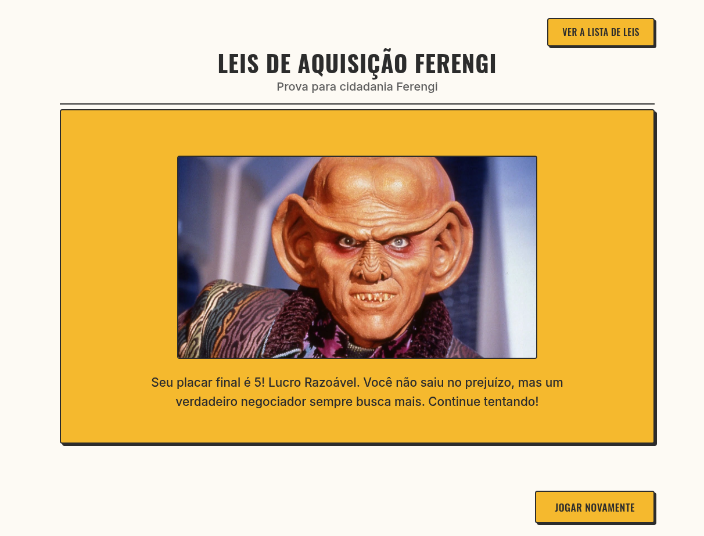

# Quiz sobre As Leis de Aquisição Ferengi

Este projeto é um divertido jogo de **quiz interativo**, desenvolvido com **Angular** 👽 + **Storybook** (para documentação dos componentes), como uma homenagem aos **Ferengi** e suas infames Leis de Aquisição do universo de Star Trek 🖖.

Ele simula um teste de conhecimento sobre as regras que governam a sociedade Ferengi, responda a perguntas de múltipla escolha, receba feedback instantâneo (com reações do próprio Quark!) e veja se você tem a astúcia necessária para acumular seu Latinum virtual!

### Quem são os ferengis?

Os Ferengi em Star Trek simbolizam uma sátira do capitalismo extremo e da cultura de consumo, com suas "Leis de Aquisição" elevando a ganância a um código moral. Eles servem como contraponto aos ideais utópicos da Federação e como crítica ao sexismo através de suas estruturas sociais tradicionais.

> Saiba mais sobre os Ferengis [aqui](https://memory-alpha.fandom.com/pt/wiki/Ferengi#:~:text=Os%20ferengis%20ou%20ferenguis%20s%C3%A3o,afiados%20e%20a%20baixa%20estatura.)

## Resultado ✨

- **Você pode conferir o resultado nos seguintes locais:** 
  - **[VERCEL](https://ferengi-rules.vercel.app/)**
  - **[AWS](http://ferengi-rules.s3-website-sa-east-1.amazonaws.com)**

- **[Confira o Storybook AQUI 🎨 📑](https://ferengi-components.vercel.app/)**



## Feito com 🔨

- **Angular**
- **Storybook**

Agradecimentos especiais ao [darkyen](https://gist.github.com/darkyen) que compilou as leis ferengi **[aqui](https://gist.github.com/darkyen/120c46739985ebf3b39b)**

## Funcionalidades

- **Introdução Temática:** Uma breve introdução imersiva no universo Ferengi antes de começar o quiz 🛸.
- **Quiz Interativo:** Responda perguntas de múltipla escolha sobre as Leis de Aquisição 🧠.
- **Feedback Instantâneo:** Saiba imediatamente se acertou ou errou, com reações visuais do Quark! 😂😠
- **Pontuação (Lucro!):** Acompanhe seu "lucro" em Latinum a cada resposta correta 💰.
- **Lista de Leis:** Consulte a lista completa das Leis de Aquisição a qualquer momento para referência 📜.
- **Feedback Final:** Receba uma mensagem personalizada baseada no seu desempenho final no quiz.

## Rodando localmente

Para executar este projeto em seu ambiente de desenvolvimento, siga estas etapas:

1.  **Pré-requisitos:**

    - [Node.js](https://nodejs.org/) (que inclui o npm) instalado.
    - [Angular CLI](https://angular.io/cli) instalado globalmente (`npm install -g @angular/cli`).

2.  **Clone o repositório:**

    ```bash
    git clone https://github.com/dev-araujo/ferengi-rules.git

    ```

3.  **Instale as dependências:**

    ```bash
    npm install
    # ou
    yarn install
    ```

4.  **Execute o servidor de desenvolvimento:**
    ```bash
    ng serve
    ```
    Isso iniciará a aplicação em `http://localhost:4200/` e abrirá automaticamente no seu navegador padrão.

---

#### Autor 👷


[Adriano P Araujo](https://www.linkedin.com/in/araujocode/)
